# weather-robustness-benchmark
Measure how a standard CNN’s performance + confidence changes as weather-like corruptions get worse.

## Abstract
Deep learning models for visual perception are typically evaluated under clean, in-distribution conditions. However, real-world autonomous systems must operate under adverse weather and illumination, where distribution shifts are severe and often safety-critical.

In this project, we systematically evaluate the robustness of a standard end-to-end CNN (ResNet-18) trained on CIFAR-10 under five weather-like corruptions: blur, fog, rain, low-light, and snow, each applied at increasing severity levels.

Beyond accuracy, we analyze model confidence and predictive entropy to study reliability and uncertainty behavior under degradation. Our results show that end-to-end CNNs fail in non-uniform and sometimes overconfident ways, highlighting the limitations of accuracy-only evaluation and motivating reliability-aware and fusion-based perception systems.

## Method
### Model and Dataset

Architecture: ResNet-18

Dataset: CIFAR-10

Training: Standard supervised training on clean images only

Evaluation: Test-time corruption without retraining

## Weather-like Corruptions

Applied five corruption types, each at five severity levels:

Blur: Progressive Gaussian blur (loss of high-frequency detail)

Fog: Contrast attenuation and scattering effects

Rain: Structured noise and occlusion patterns

Low-Light: Global illumination reduction

Snow: Sparse occlusion with edge preservation

These corruptions simulate real-world adverse sensing conditions commonly encountered in autonomous perception.

### Metrics

For each corruption and severity level, we report:

Accuracy: Classification correctness (How often is the model correct?)

Mean Confidence: Average maximum softmax probability (How confident the model is in the class it predicts?)

Mean Entropy: Average predictive entropy (How uncertain the model is across all classes?)

This allows us to distinguish between incorrect but uncertain vs. incorrect and overconfident behavior.

## Results
### Robustness Trends

Accuracy degrades nonlinearly with severity across all corruption types, but the failure modes differ significantly:

Blur: Causes catastrophic accuracy collapse even at mild severity, revealing heavy reliance on high-frequency texture cues.

Fog: Produces gradual degradation with increasing uncertainty, indicating relatively well-calibrated behavior.

Rain: Leads to mild accuracy loss while maintaining high confidence, exposing miscalibration under structured noise.

Low-Light: Triggers sharp entropy increases and confidence collapse, reflecting genuine epistemic uncertainty.

Snow: Remains robust until high severity, after which performance drops abruptly.

### Confidence–Entropy Mismatch

In several cases (notably blur and rain), confidence remains high even as accuracy degrades, indicating overconfident failures. This behavior is particularly dangerous in safety-critical systems, where confidence is often used for downstream decision-making.

The results demonstrate that:

Accuracy alone is insufficient to assess model reliability under distribution shift.

### The following plots summarize accuracy, mean confidence, and predictive entropy as a function of corruption severity.

### Blur
| Accuracy                                   | Confidence                                        | Entropy                                        |
| ------------------------------------------ | ------------------------------------------------- | ---------------------------------------------- |
| 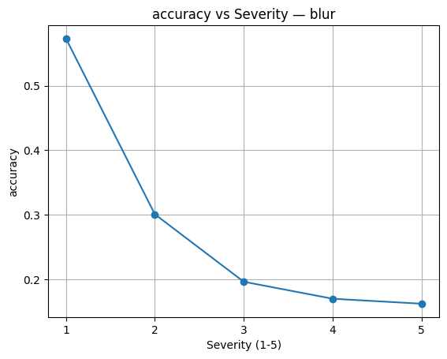 | 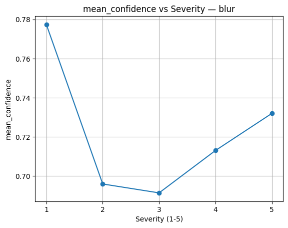 | 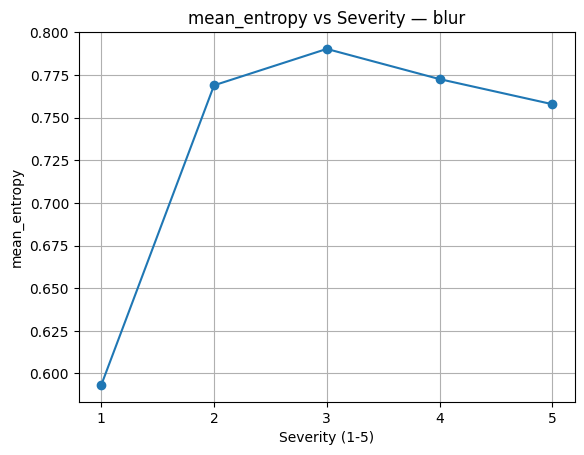 |
#### Blur causes early feature destruction, followed by overconfident failure, not graceful degradation.
### Fog
| Accuracy                                  | Confidence                                       | Entropy                                       |
| ----------------------------------------- | ------------------------------------------------ | --------------------------------------------- |
| 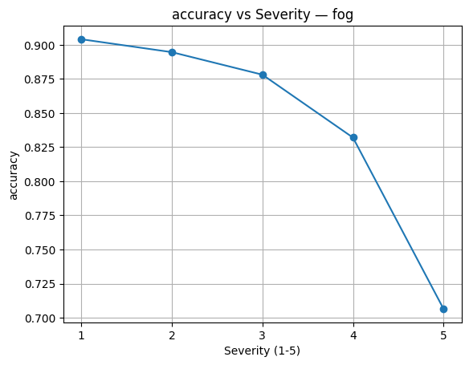 | 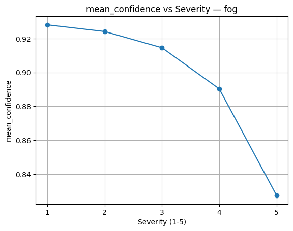 | 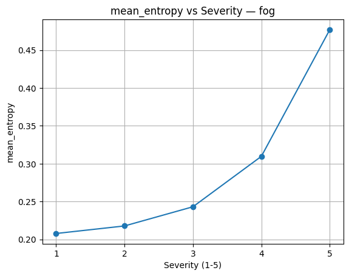 |
#### Fog induces honest uncertainty, not hallucination.
### Rain
| Accuracy                                   | Confidence                                        | Entropy                                        |
| ------------------------------------------ | ------------------------------------------------- | ---------------------------------------------- |
| 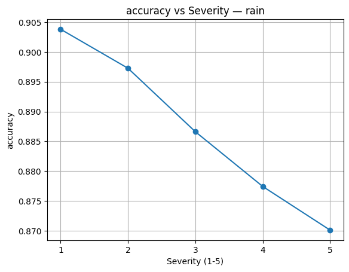 | 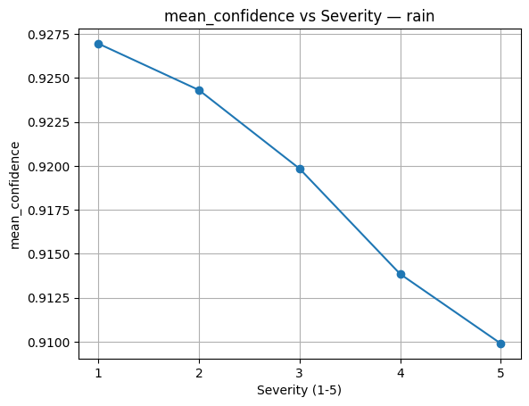 | 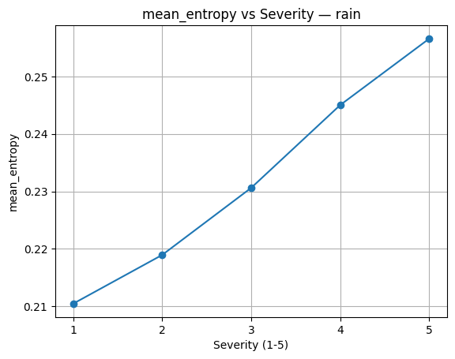 |
#### Rain corrupts appearance but not semantic structure.
### Low-Light
| Accuracy                                       | Confidence                                            | Entropy                                            |
| ---------------------------------------------- | ----------------------------------------------------- | -------------------------------------------------- |
| 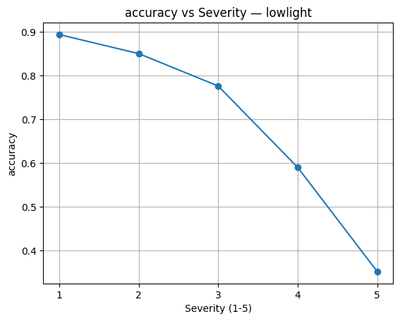 | 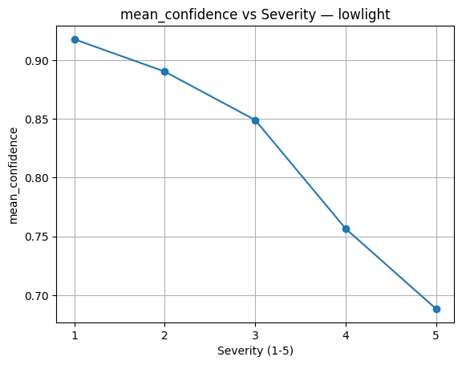 | 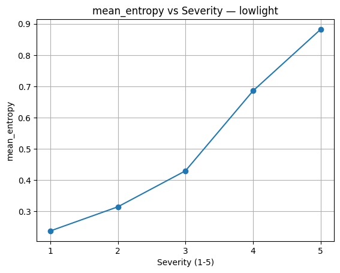 |
#### Low-light causes genuine epistemic uncertainty.
### Snow
| Accuracy                                   | Confidence                                        | Entropy                                        |
| ------------------------------------------ | ------------------------------------------------- | ---------------------------------------------- |
| 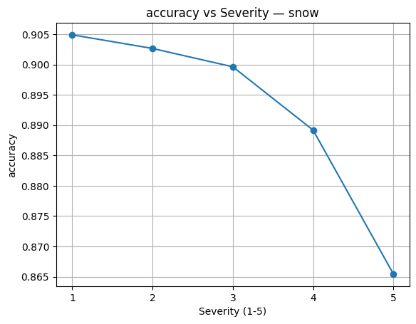 | 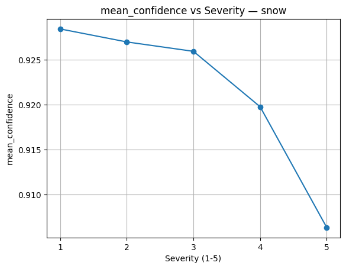 | 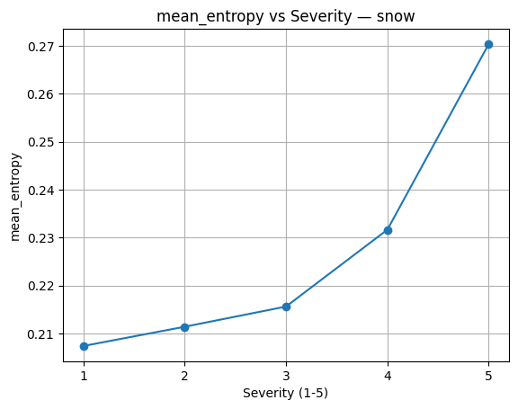 |
#### Snow introduces structured occlusions but preserves edges.

## Takeaways

End-to-end CNNs exhibit corruption-specific failure modes, not a single notion of robustness.

Some degradations (e.g., fog, low-light) produce meaningful uncertainty signals, while others (e.g., blur) lead to confident hallucinations.

Overconfident failures emerge naturally under certain corruptions, even without adversarial inputs.

Reliability-aware evaluation (confidence, entropy) is essential for safety-critical perception systems.

These findings motivate architectures that incorporate uncertainty awareness, sensor fusion, and task-aware reliability mechanisms, rather than relying solely on end-to-end optimization.

> **Key Insight:** Certain corruptions (e.g., blur) induce overconfident failures, while others (e.g., fog, low-light) produce honest uncertainty. Robust perception therefore requires reliability-aware mechanisms, not accuracy-only optimization.

## Conclusion
This benchmark serves as a diagnostic baseline for studying robustness, calibration, and failure modes of vision models under adverse conditions. It directly motivates subsequent work on reliability-aware and multimodal perception frameworks, including sensor fusion approaches for autonomous systems.
